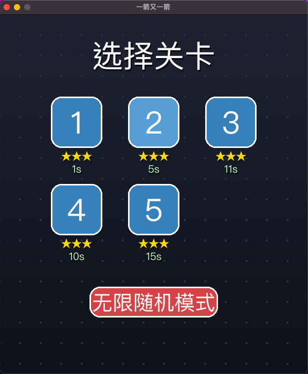
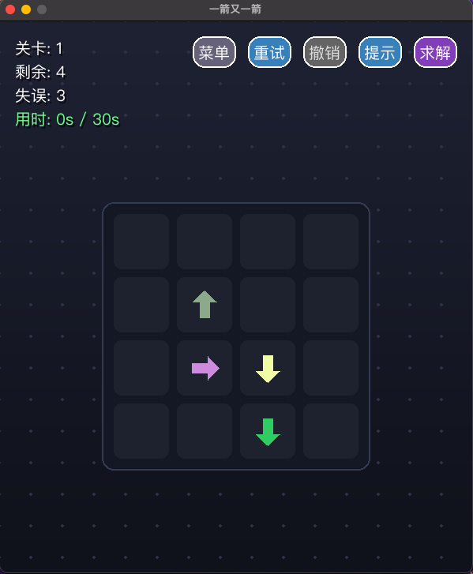
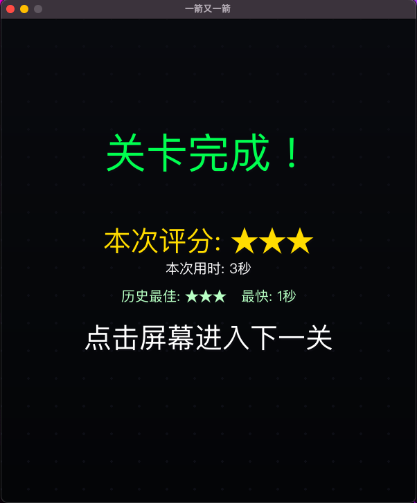

# 🏹 一箭又一箭 (One Arrow After Another)


## 1. 项目名称
**一箭又一箭** —— 基于 Python 的益智解谜与算法可视化游戏 (软件工程课程项目)

## 2. 游戏简介
这是一款考验空间逻辑与路径规划的休闲解谜游戏。玩家需要观察二维网格中不同朝向的箭头，通过点击找出没有任何阻挡的箭头使其飞出棋盘。
本项目不仅实现了基础的消除玩法，更在此基础上深度融合了《数据结构》与《人工智能导论》的核心理论，兼具极高的可玩性与工程示范价值。

### ✨ 核心技术亮点
*   **🧠 智能算法赋能**：内置基于 **DFS（深度优先搜索）** 的智能求解器，实现毫秒级全盘推演与动画演示；并引入防作弊机制，保证成绩公正。
*   **♾️ 逆向时间生成**：独创“时光倒流（Reverse-Time）”撒子算法，从数学原理上 100% 保证无限随机生成的关卡绝对无死锁。
*   **💾 数据持久化与状态机**：利用字典与 JSON 序列化技术实现断点续玩；基于 **历史状态栈（Stack）** 实现无缝的全局撤销（Undo）。
*   **🎨 纯代码视觉渲染**：摒弃外部图片依赖，纯靠 Pygame 底层数学运算（三角函数、透明度叠加、几何多边形绘制）实现赛博朋克风渐变背景与呼吸灯特效。

## 3. 项目结构
本项目采用高内聚、低耦合的模块化设计，核心代码结构如下：
```text
📦 One_Arrow_After_Another
 ┣ 📜 main.py            # 游戏主循环、事件监听与状态机控制模块
 ┣ 📜 arrows.py          # Arrow 实体类、运动学更新与多边形渲染逻辑
 ┣ 📜 configs.py         # 全局常量、矩阵关卡数据与 UI 调色板配置
 ┣ 📜 README.md          # 项目说明文档
 ┣ 📜 requirements.txt   # 项目依赖文档
 ┗ 📦 main.app.zip       # macOS 平台专属独立运行包 (Release)
```

## 4. 开发环境
* 操作系统：macOS (原生支持)，兼容 Windows / Linux
* 编程语言：Python 3.12 (向下兼容至 3.8+)
* 核心依赖库：Pygame 2.x

## 5. 安装和运行方法
方式一：开发者模式（源码运行）
### 1. 确保本地已安装 Python 环境。
### 2. 克隆本仓库至本地，并在终端执行以下命令安装依赖：
```bash
pip install pygame
```
### 3. 在项目根目录执行主程序：
```bash
python main.py
```
方式二：玩家模式（免环境直接运行）
本项目已通过 PyInstaller 编译为独立应用程序。
* macOS 用户：在项目根目录解压 main.app.zip，双击生成的 main.app 即可直接游玩（无需配置任何 Python 环境）。

## 6. 游戏操作与快捷键说明
| 操作 / 快捷键 | 	功能描述	      |核心逻辑支撑|
|----------|-------------|-----|
| 鼠标左键	    | 点击菜单按钮或消除箭头 |	射线阻挡检测与向量坐标映射|
| 键盘 Z 键   | 	撤销 (Undo)  | 	从历史状态快照栈（Stack）弹出上一帧数据 |
|键盘 H 键	|智能提示 (Hint)|	后台遍历探测合法突破口并施加正弦波呼吸灯|
|键盘 A 键	|AI 自动求解 (Solve)|	挂载 DFS 搜索树，接管主循环进行延时演示|
|退出游戏|	触发自动存档	|序列化当前矩阵与对象状态写入 save_data.json|

## 7. 游戏截图



